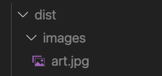
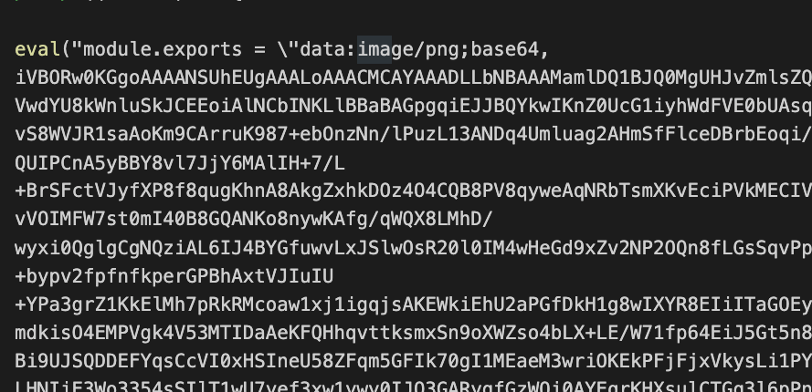

# Webpack 이해하기

프론트엔드 개발환경 이해하기

## 프론트엔드 개발에 NodeJs가 필요한 이유

- 최신 스펙으로 개발 가능
- 빌드 자동화
- 개발 환경 커스터마이징

## Webpack 맛보기

### 프로젝트 생성

```js
npm init -y // npm 초기환경 셋
npm i -D webpack webpack-cli // 웹팩 설치
```

초기 프로젝트 생성 후 개발환경을 위한 웹팩을 설치합니다.
(현재 실습중인 웹팩은 버젼5기준입니다.)

이후 최상위구조에 webpack.config.js 라는 파일을 생성합니다.
해당 파일에서 webpack의 설정을 관리할 수 있습니다.

### 웹팩 필수조건

- mode
- entry
- output

웹팩에서 설정시 필수로 있어야하는 환경조건이 있습니다.
위 3가지가 필수 조건입니다.

- mode = 개발모드(development), 출시모드(production),none(모드설정안함)
- entry = 초기 읽어올 파일의 주소 설정
- output = 번들링된 코드를 최종적으로 어떤곳에 배포할것인가를 정하는 설정

```js
const path = require("path");

module.exports = {
  mode: "development", // 개발모드
  entry: {
    main: "./src/app.js", //src에 있는 app.js를 읽을 파일로 설정한다.
    // main : path.resolve(__dirname, 'app.js') // __dirname은 현재파일 위치의 절대경로를 알려주는 NodeJs의 변수이다.
  },
  output: {
    path: path.resolve("./dist"), // 아웃풋이 될 폴더경로 지정
    filename: "[name].js", // 파일 이름 지정
    // [contenthash] : 자동hash
    // [ext] : 확장자
  },
};
```

설정된 웹팩환경을 실행하기 위해
package.json에서 명령어를 추가합니다.

```js
// package.json
 "scripts": {
    "build": "webpack --progress"
  }
  // --progress : 빌드상태를 커맨드라인에 표시합니다.
```

이후 npm run build 명령어 입력시 실행가능 합니다.

### loader

**로더란?**
webpack은 모든 파일을 모듈화합니다.
좀더 상세하게는 JS뿐만이 아닌 file, css, 기타등등 모든 데이터를 중복되지않는 모듈화를 지원합니다.
이것이 가능한 이유가 webpack의 loader덕분입니다.
loader는 여러 다른 TS와 같은 파일은 JS로 변환해주거나 이미지를 data URL형식의 문자열로도 배포합니다.
또한 css파일을 js에서 직접 읽어올수 있도록 합니다.

**babel**
현재 IE는 지원을 종료하였지만 그래도 크로스 브라우징을 위한목적의 ECMAScript2015+ 이상버젼을 이하버젼로 낮추는 역할은 중요합니다.
이를 위하여 바벨은 존재하며 최신 js의 코드를 구버젼 브라우저에서도
잘돌아가게끔 할 목적을 가지고 있습니다.

```js
npm i babel-loader @babel/core @babel/preset-env
```

- babel-loader : 웹팩에서 바벨을 사용하는 로더모듈
- @babel/core : 바벨의 역할을 하는 시스템
- @babel/presets-env : js를 다운그레이드하는 내용을 담은 프리셋

npm 설치 후
babel.config.js 또는 .babelrc 파일을 만든 후
설치된 바벨의 스타일을 지정합니다.

```js
{
  "presets": ["@babel/preset-env"]
}
```

이후 웹팩의 모듈부분에서 빌드될 시 사용될 바벨을 추가합니다.

```js
{
  test: /\.js$/,
  use: ["babel-loader"], // babel-loader 설정
  exclude: /node_modules/, // node_modules는 바벨하지 않는다.
},
```

**css-loader & style-loader**
CSS파일을 모듈화하여 JS에서 읽어오려면
css-loader, style-loader를 사용합니다.

먼저 로더를 설치합니다.

```js
npm i -D css-loader style-loader
```

이후 웹팩에서 로더환경을 설정합니다.

```js
module.exports = {
  module: {
    rules: [
      {
        test: /\.css$/, // .css 확장자로 끝나는 모든 파일
        use: ["css-loader", "style-loader"], // loader를 적용한다
      },
    ],
  },
};
```

- css-loader : css를 자바스크립트 모듈화한다.
- style-loader : 모듈화된 css를 js에 접목시켜 돔에 추가하는 역할

**sass/scss**
스타일에서 css뿐 아니라 sass or scss를 컴파일러 할수도있다.

```js
npm i -D sass-loader node-sass
```

- sass-loader : 웹팩에서 sass파일을 읽기위함의 로더
- node-sass : sass파일을 스타일css로 컴파일러 하는 역할입니다.

```js
module.exports = {
  module: {
    rules: [
      {
        test: /\.(css||scss)$/, // .css 확장자로 끝나는 모든 파일
        use: ["css-loader", "style-loader", "sass-loader"], // loader를 적용한다
      },
    ],
  },
};
```

**asset**
asset loader는 이전 웹팩4버젼의 file-loader, url-loader와 같은 역할을 합니다.
asset은 4가지 로더를 제공한다. (하지만 기록은 우선적으로 공부한 부분만 기록됩니다.)

자세한 사항은 / [webpack5 asset](https://webpack.kr/guides/asset-modules/) 참조

- asset/resource : 파일을 추출합니다. 웹팩4의 file-loader와 동일합니다.
- asset/inline : 파일을 data URL로 번들합니다. 웹팩4의 url-loader와 동일합니다.
- asset : 지정된 용량의 이하면 inline, 이상은 resource로 추출합니다.

**asset/resource**

```js
module.exports = {
  module: {
    rules: [
      {
        test: /\.(png||jpg)$/,
        type: "asset/resource",
      },
    ],
  },
};
```



**asset/inline**

```js
module.exports = {
  module: {
    rules: [
      {
        test: /\.(png||jpg)$/,
        type: "asset/inline",
      },
    ],
  },
};
```



**asset**

```js
module.exports = {
    {
        test: /\.(png||jpg)$/, // png, jpg형식을 읽는다.
        type: "asset", // 40kb미만은 inline, 이상은 resource로 대처
        parser: {
            dataUrlCondition: { // size limit
            maxSize: 40 * 1024, // 40kb // limit value
            },
        },
    },
}

```

### plugin

로더는 각각의 파일들을 분할 모듈단위로 처리된다. 하지만 플러그인은 번들된 결과물이라는 한정에서
동작한다. 번들된 파일을 정리하거나 관리하는 용도로 사용된다.
웹팩에서 기본적으로 제공되는 기본내장 플러그인과 npm에서 다운받아 사용할 플러그인이 있다.

### plugin-기본형

**BannerPlugin**
번들링된 파일에 각종 빌드정보 및 커밋정보를 삽입할 수 있다.

```js
const webpack = require("webpack");
const ChildProcess = require("child_process");

module.exports = {
  plugins: [
    new webpack.BannerPlugin({
      banner: () => `
      build date : ${new Date().toLocaleString()}
      commit : ${ChildProcess.execSync("git rev-parse --short HEAD")}
      anchor : ${ChildProcess.execSync("git config user.name")}
      `,
    }),
  ]
```

**DefinePlugin**
모드환경(개발,배포)에 따라 다른 api정보등을 처리할때 사용된다.
빌드 타임에 결정된 값을 어플리이션에 전달할 때는 이 플러그인을 사용하자.

```js
const webpack = require("webpack");
const currentMode = process.env.NODE_ENV; // development or production

new webpack.DefinePlugin({
    "api.domain": JSON.stringify("http://dev...."), // api-domain을 불러오면 http://dev....가 로드된다.
    "current.mode":
    currentMode === "development" // 현재 모드에 따라서 사용되는 api 변경
        ? JSON.stringify("develop-api")
        : JSON.stringify("production-api"),
}),
```

### plugin-서드 파티 패키지

**HtmlWebpackPlugin**
html파일을 후처리하는데 사용된다. 빌드되는 html파일의 값을 넣거나 압축이 가능하다.
!(사이트 참조)[https://github.com/jantimon/html-webpack-plugin#options]

```js
npm install -D html-webpack-plugin
```

```js
//webpack.config.js
const currentMode = process.env.NODE_ENV;

new HtmlWebpackPlugin({
    title: currentMode === "development" ? "개발용" : "배포용",
    template: "./index.html",
    minify:
    currentMode === "production"
        ? {
            collapseWhitespace: true, // 빈칸 제거
            removeComments: true, // 주석 제거
        }
        : false,
}),

//index.html
<html>
    <head>
        <title><%= htmlWebpackPlugin.options.title %></title>
    </head>
    ...body
</html>
```

**CleanWebpackPlugin**
빌드 이전 결과물을 전체삭제한 후 재빌드되는 최신파일들로 유지되게한다.

```js
npm install -D clean-webpack-plugin
```

```js
const { CleanWebpackPlugin } = require("clean-webpack-plugin");

module.exports = {
  plugins: [new CleanWebpackPlugin()],
};
```

**MiniCssExtractPlugin**
개발모드가 아닌 배포용일때는 css를 js에 통합하지않고 분리하는것이 성능적으로 좋다.
그렇기에 위 패키지를 이용한다.

```js
npm install -D mini-css-extract-plugin
```

```js
const MiniCssExtractPlugin = require("mini-css-extract-plugin");

module.exports = {
  plugins: [
    ...(process.env.NODE_ENV === "production"
      ? [new MiniCssExtractPlugin({ filename: `[name].css` })]
      : []),
  ],
};
```

**또한 위 패키지는 개발모드에서 사용되던 css-loader와 style-loader의 별개로 프로덕션모드에서는 MiniCssExtractPlugin 패키지가 제공하는 별도로 CSS파일을 추출하는 다른 로더가 필요하다.**

```js
module.exports = {
  module: {
    rules: [
      {
        test: /\.css$/,
        use: [
          process.env.NODE_ENV === "production"
            ? MiniCssExtractPlugin.loader // 프로덕션 환경
            : "style-loader", // 개발 환경
          "css-loader",
        ],
      },
    ],
  },
};
```

## 공부하며 든 의문점 리스트

**devDependencies, dependencies의 차이**

- dependencies : 프로덕션(출시)환경에서 응용 프로그램에 필요한 패키지
- devDependencies : 로컬 개발 및 테스트에만 필요한 패키지

**webpack-cli가 무엇인가?**
웹팩관 관련된 명령어를 실행할 수 있도록 하는 패키지라고 한다.
