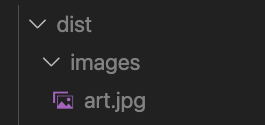
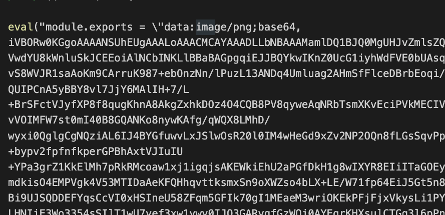

# Webpack 이해하기

프론트엔드 개발환경 이해하기

## 프론트엔드 개발에 NodeJs가 필요한 이유

- 최신 스펙으로 개발 가능
- 빌드 자동화
- 개발 환경 커스터마이징

## Webpack 맛보기

### 프로젝트 생성

```js
npm init -y // npm 초기환경 셋
npm i -D webpack webpack-cli // 웹팩 설치
```

초기 프로젝트 생성 후 개발환경을 위한 웹팩을 설치합니다.
(현재 실습중인 웹팩은 버젼5기준입니다.)

이후 최상위구조에 webpack.config.js 라는 파일을 생성합니다.
해당 파일에서 webpack의 설정을 관리할 수 있습니다.

### 웹팩 필수조건

- mode
- entry
- output

웹팩에서 설정시 필수로 있어야하는 환경조건이 있습니다.
위 3가지가 필수 조건입니다.

- mode = 개발모드(development), 출시모드(production),none(모드설정안함)
- entry = 초기 읽어올 파일의 주소 설정
- output = 번들링된 코드를 최종적으로 어떤곳에 배포할것인가를 정하는 설정

```js
const path = require("path");

module.exports = {
  mode: "development", // 개발모드
  entry: {
    main: "./src/app.js", //src에 있는 app.js를 읽을 파일로 설정한다.
    // main : path.resolve(__dirname, 'app.js') // __dirname은 현재파일 위치의 절대경로를 알려주는 NodeJs의 변수이다.
  },
  output: {
    path: path.resolve("./dist"), // 아웃풋이 될 폴더경로 지정
    filename: "[name].js", // 파일 이름 지정
    // [contenthash] : 자동hash
    // [ext] : 확장자
  },
};
```

설정된 웹팩환경을 실행하기 위해
package.json에서 명령어를 추가합니다.

```js
// package.json
 "scripts": {
    "build": "webpack"
  }
```

이후 npm run build 명령어 입력시 실행가능 합니다.

### loader

**로더란?**
webpack은 모든 파일을 모듈화합니다.
좀더 상세하게는 JS뿐만이 아닌 file, css, 기타등등 모든 데이터를 중복되지않는 모듈화를 지원합니다.
이것이 가능한 이유가 webpack의 loader덕분입니다.
loader는 여러 다른 TS와 같은 파일은 JS로 변환해주거나 이미지를 data URL형식의 문자열로도 배포합니다.
또한 css파일을 js에서 직접 읽어올수 있도록 합니다.

**css-loader & style-loader**
CSS파일을 모듈화하여 JS에서 읽어오려면
css-loader, style-loader를 사용합니다.

먼저 로더를 설치합니다.

```js
npm i -D css-loader style-loader
```

이후 웹팩에서 로더환경을 설정합니다.

```js
module.exports = {
  module: {
    rules: [
      {
        test: /\.css$/, // .css 확장자로 끝나는 모든 파일
        use: ["css-loader", "style-loader"], // loader를 적용한다
      },
    ],
  },
};
```

- css-loader : css를 자바스크립트 모듈화한다.
- style-loader : 모듈화된 css를 js에 접목시켜 돔에 추가하는 역할

**asset**
asset loader는 이전 웹팩4버젼의 file-loader, url-loader와 같은 역할을 합니다.
asset은 4가지 로더를 제공한다. (하지만 기록은 우선적으로 공부한 부분만 기록됩니다.)

자세한 사항은 / [webpack5 asset](https://webpack.kr/guides/asset-modules/) 참조

- asset/resource : 파일을 추출합니다. 웹팩4의 file-loader와 동일합니다.
- asset/inline : 파일을 data URL로 번들합니다. 웹팩4의 url-loader와 동일합니다.
- asset : 지정된 용량의 이하면 inline, 이상은 resource로 추출합니다.

**asset/resource**

```js
module.exports = {
  module: {
    rules: [
      {
        test: /\.(png||jpg)$/,
        type: "asset/resource",
      },
    ],
  },
};
```



**asset/inline**

```js
module.exports = {
  module: {
    rules: [
      {
        test: /\.(png||jpg)$/,
        type: "asset/inline",
      },
    ],
  },
};
```



**asset**

```js
module.exports = {
    {
        test: /\.(png||jpg)$/, // png, jpg형식을 읽는다.
        type: "asset", // 40kb미만은 inline, 이상은 resource로 대처
        parser: {
            dataUrlCondition: { // size limit
            maxSize: 40 * 1024, // 40kb // limit value
            },
        },
    },
}

```

## 공부하며 든 의문점 리스트

**devDependencies, dependencies의 차이**

- dependencies : 프로덕션(출시)환경에서 응용 프로그램에 필요한 패키지
- devDependencies : 로컬 개발 및 테스트에만 필요한 패키지

**webpack-cli가 무엇인가?**
웹팩관 관련된 명령어를 실행할 수 있도록 하는 패키지라고 한다.
